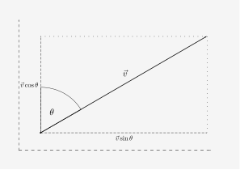
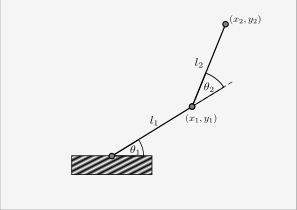

# Optimal Control

### Available algorithms

#### Linear–quadratic regulator [LQR](control_algorithms/linear_quadratic_regulator.py)

Implementation of LQR allows to control with either linear and not linear systems.
However, it guarantees the optimality only for the linear systems.
For nonlinear dynamics, how close the resulting trajectory will be to the optimum depends mainly on how much the dynamics varies with the state of the system. Second important factor is how big is the error of linear dynamic approximation.

What is also important, the linearization is given by Taylor expansion of dynamic at some state $x_0$ and with zero control $u_0 = 0$

$$
f(x, u) = f(x_0, 0) + \frac{\partial f}{\partial x}(x - x_0) + \frac{\partial f}{\partial u} u + o(\|x - x_0\| + \|u\|) 
$$

$$
= f(x_0, 0) + A_f (x - x_0) + B_f u + o(\|x - x_0\| + \|u\|)
$$

If the dynamic of the system $f(x_0, 0)$ is not zero in $x_0$, we will have constant errors while aproximating $f(x, u)$.

### Models description

1. Rocket railroad car

$$
x = \begin{bmatrix}
    p & \dot{p}
\end{bmatrix}^{T}
\qquad
u = \ddot{p}
$$

$$
\dot{x}(t) = 
\begin{bmatrix} 
    0 & 1 \\ 
    0 & 0 
\end{bmatrix} x(t) + \begin{bmatrix} 
    0 \\ 
    1 
\end{bmatrix} u(t)
$$

2. Seeker

$$
x = 
\begin{bmatrix}
    \hat{x}, \hat{y}, \alpha
\end{bmatrix}^{T}
\qquad
u = \begin{bmatrix}
    v, \omega
\end{bmatrix}^{T}
$$

$$
\dot{x}(t) = 
\begin{bmatrix} 
    \sin(\alpha) & 0 \\
    \cos(\alpha) & 0 \\
    0            & 1
\end{bmatrix} 
u(t)
$$

,where
$v \in \mathbb{R}$ is a velocity and
$\omega = \dot{\alpha} \in \mathbb{R}$ is an angular velocity

3. Two link arm

3a. Two link arm (position based - kinematic control)

$$
x = 
\begin{bmatrix}
    x_1, y_1, x_2, y_2
\end{bmatrix}^{T}
\qquad
u = \begin{bmatrix}
    \dot{\theta}_1, \dot{\theta}_2
\end{bmatrix}^{T}
$$

$$
\dot{x}(t) =
\begin{bmatrix}
    -l_1 \sin(\theta_1) & 0 \\ 
    l_1 \cos(\theta_1) & 0 \\
    -l_2 \sin(\theta_1 + \theta_2) - l_1 \sin(\theta_1) & -l_2 \sin(\theta_1 + \theta_2) \\ 
    l_2 \cos(\theta_1 + \theta_2) + l_1 \cos(\theta_1) & l_2 \cos(\theta_1 + \theta_2)
\end{bmatrix} 
u(t)
$$

3b. Two link arm (angle based - dynamic control)

$$
x = \begin{bmatrix}
    \theta_1, \dot{\theta}_1, \theta_2, \dot{\theta}_2
\end{bmatrix}^{T}
\qquad
u = \begin{bmatrix}
    \ddot{\theta}_1, \ddot{\theta}_2
\end{bmatrix}^{T}
$$

$$
\dot{x}(t) = 
\begin{bmatrix} 
    0 & 0 & 1 & 0 \\ 
    0 & 0 & 0 & 1 \\ 
    0 & 0 & 0 & 0 \\ 
    0 & 0 & 0 & 0 \\ 
\end{bmatrix} x(t) + \begin{bmatrix} 
    0 & 0 \\
    0 & 0 \\
    1 & 0 \\
    0 & 1 \\    
\end{bmatrix} 
u(t)
$$
